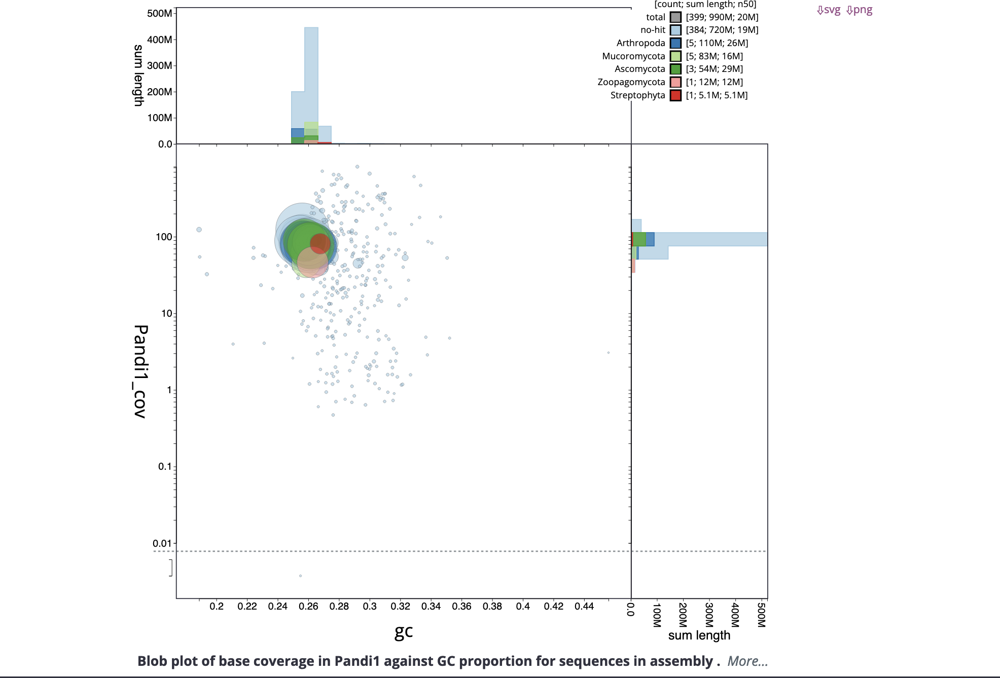

# BlobTools walkthrough for BioHPC

This is a guide to use the software [**BlobTools2**](https://blobtoolkit.genomehubs.org/), specifically on the Bushley BioHPC server. I have already downloaded and prepared all of the necessary software and libraries for you to successfully run this pipeline. All you need is a genome assembly (.fa, .fasta) and the set of reads you used to create your genome assembly (.fq, .fastq).

BlobTools/BlobToolKit is a software suite that allows you to identify and isolate contaminent or non-target DNA from your genome assembly. This software integrate taxonomic information, coverage, and basis sequence stats to identify reads that are potentially contamination. 


There are three types of data that can be added to the BlobTools project file for visualization

1. **NCBI blastn hits**  
   - See: `blastn_blobtools_${PROJECT_NAME}.sh`  
   - You could also perform a BLASTX search with the UniProt database and add those hits.  
   - In practice, BLASTN with the ncbi nt database is usually sufficient.

2. **Coverage data**  
   - Requires mapping reads back to the assembly (e.g., with minimap2).  
   - Important: adjust the `-ax` option depending on sequencing technology (Illumina, PacBio, ONT).  
   - Very large files require substantial memory (e.g., 40+ threads).  
   - See: `minimap2_blobtools_${PROJECT_NAME}.sh`.

3. **BUSCO hits** (optional)  
   - BlobTools can also incorporate BUSCO results.  
   - Often skipped, since BLAST results typically provide good taxonomic assignments.

Here we will use BioHPC for computationally heavy tasks (BLAST, read mapping, creating the project "blob"). The project visualization can be performed locally.

We will use Alex's Pdip (PacBio) assembly as test case.

Please cite all software and their versions appropriately! See the bottom of this walkthrough for a non-exhaustive list of citations.

---

## Step 0: Obtain a fasta file

If you have a Graphical Fragment Assembly (.gfa) assembly (i.e. the standard output of Hifiasm), you first need to convert your assembly to the fasta format. You can do this using this simple command:

```bash
awk '/^S/{print ">"$2;print $3}' Pdip_trim_out.asm.bp.p_ctg.gfa > Pandi1_genomic.fasta
```

This step takes less than a minute on the login node. 

---


## Step 1: Project setup and define variables

Create a project folder in your working directory. Use a short, information name for each separate project/genome.

At the beginning of each session or script, set the following:

Here, I use the name Pandi1 for Alex's *Pandora dipteragena* genome.

```bash
# Project name
PROJECT_NAME="Pandi1"

# BlobTools version
BTK_VERSION="2.6.3"

# Directories
blob_dir=/local/workdir/$USER/blobtoolkit_${PROJECT_NAME}
files_dir=${blob_dir}/files
blast_dir=${blob_dir}/blast
map_dir=${blob_dir}/map
commands=${blob_dir}/commands
logs=${blob_dir}/logs
taxdump=/local/workdir/software/blobtoolkit/taxdump/
ncbi_nt=/local/workdir/software/blobtoolkit/nt/
```

Now, create your project folder and all necessary subfolders. You only need to do this once for each project. 

```bash
mkdir -p $files_dir $blast_dir $map_dir $commands $logs
```

Copy your genome assembly into your project folder, to keep everything neat. 

```
cp Pandi1_genomic.fasta $files_dir
```

---

## Step 2: Initialize your BlobTools project

This step can be run on the BioHPC login node. First, activate the BioHPC BlobTools environment. 

```bash
source /programs/miniconda3/bin/activate btk_env
export BTK_ROOT=/programs/blobtoolkit-${BTK_VERSION}
```

Then, start a new BlobTools folder by providing your genome assembly:

```bash
$BTK_ROOT/blobtools2/blobtools create --fasta $files_dir/Pandi1_genomic.fasta $blob_dir
```

This step is also quite fast (less than a minute on the login node).

---

## Step 3: Generate NCBI BLAST hits

This step will be submitted to BioHPC using a job script. See [blastn_blobtools.sh](commands/blastn_blobtools.sh) for the full BioHPC job script. 

This job can take hours or even days depending on how much resources you provide and the size of your query genome.

Most of the time I use the NCBI nt database because it is comprehensive. You could provide a smaller, curated database (RefSeq, SwissProt for proteins) and this step will run faster, but you may miss out on identifying certain taxa. If you know the taxa that are likely to be in your sample, you could make a custom subset of nt to save on time. 

Example job script:

```bash
# Project variables
PROJECT_NAME="Pandi1"
ASSEMBLY_FILE="Pandi1_genomic.fasta"
THREADS="16"

files_dir=/local/workdir/$USER/blobtoolkit_${PROJECT_NAME}/files
blast_dir=/local/workdir/$USER/blobtoolkit_${PROJECT_NAME}/blast

# Add BLAST to path and set database location
export PATH=/programs/ncbi-blast-2.13.0+/bin:$PATH
export BLASTDB=/local/workdir/software/blobtoolkit/nt/

cd ${blast_dir}

# Run BLASTN on your genome
blastn \
  -db nt \
  -query ${files_dir}/${ASSEMBLY_FILE} \
  -outfmt "6 qseqid staxids bitscore std" \
  -max_target_seqs 5 \
  -max_hsps 1 \
  -evalue 1e-25 \
  -num_threads ${THREADS}  \
  -out ${PROJECT_NAME}.ncbi.blastn.out
```


### Explanation of BLASTN parameters

- `-db nt`  
  Use the NCBI nt database for nucleotide searches (comprehensive but very large).

- `-query ${files_dir}/${ASSEMBLY_FILE}`
  Input FASTA file (your genome assembly).

- `-outfmt "6 qseqid staxids bitscore std"`
  Tabular output including query ID, taxonomy ID, bitscore, and standard BLAST fields.  
  > BlobTools requires the `staxids` field for taxonomic assignment.

- `-max_target_seqs 5`
  Limit to the top 5 hits per query sequence. Keeps the output manageable.

- `-max_hsps 1`
  Report only the best alignment (HSP) per query–subject pair.

- `-evalue 1e-25`
  Filter out weak matches. Only keep hits with very low probability of occurring by chance.

- `-num_threads ${THREADS} `
  Number of CPU threads to use.

- `-out ${PROJECT_NAME}.ncbi.blastn.out`
  Output blast results name, tagged with your project name.

---

## Step 4: Generate mapping data

This step will be submitted to BioHPC using a job script. Large datasets can be very memory intensive, so request plenty of threads and RAM. See [minimap2_blobtools.sh](commands/minimap2_blobtools.sh) for the full BioHPC job script.

This step uses minimap2 to map sequencing reads back to the assembly in order to generate contig coverage information.

Example job script:

````
# Project variables
PROJECT_NAME="Pandi1"
ASSEMBLY_FILE="Pandi1_genomic.fasta"
READS_FILE="Pandi1_hifi.fastq"
THREADS="40"

blob_dir=/local/workdir/$USER/blobtoolkit_${PROJECT_NAME}
files_dir=${blob_dir}/files
map_dir=${blob_dir}/map

# Add minimap2 and samtools to path
export PATH=/programs/minimap2-2.28:$PATH
export PATH=/programs/samtools-1.20/bin:$PATH

cd ${map_dir}

# Run minimap2 (example for PacBio HiFi reads)
minimap2 \
  -ax map-hifi \
  -t ${THREADS} \
  ${files_dir}/${ASSEMBLY_FILE} \
  ${files_dir}/${READS_FILE} \
  > ${PROJECT_NAME}.sam

# Convert SAM to sorted BAM
samtools sort \
  --threads ${THREADS} \
  -O BAM \
  -o ${PROJECT_NAME}.bam \
  ${PROJECT_NAME}.sam
```
  
### Explanation of Parameters

- `-ax [preset]` 
  Preset alignment mode depends on your sequencing technology:  
  - PacBio HiFi: `-ax map-hifi`  
  - ONT long reads: `-ax map-ont`  
  - Illumina paired-end: `-ax sr`  

- `-t 40`
  Uses specified number of threads for minimap.

- `${files_dir}/${ASSEMBLY_FILE}`
  Input genome assembly in FASTA format.  

- `${files_dir}/${READS_FILE}`
  Input sequencing reads (FASTQ).  

- `> ${PROJECT_NAME}.sam`
  Output SAM file containing alignments.  

- `samtools sort --threads ${THREADS}`
  Sort alignments and convert to BAM format. Uses specified number of threads. 

- `-o ${PROJECT_NAME}.bam ${PROJECT_NAME}.sam`
  Write sorted output to a BAM file named after your project.  

Tip: SAM files can be very large (often 10–100× bigger than BAM). After verifying the BAM file, you can safely delete the SAM file to save space.

---

## Step 5: Add Data to BlobTools Project

This step combines the BLAST hits, coverage data, and taxonomy information into your BlobTools project. Once this is complete, the project folder will contain everything needed for downstream visualization. See [add_blobtools.sh](commands/add_blobtools.sh) for the full BioHPC job script.

This step can take a while to run, depending on the size of the assembly and datasets, so submit it as a job.  


Example job script:

```bash
# Project variables
PROJECT_NAME="Pandi1"
THREADS="16"

blob_dir=/local/workdir/$USER/blobtoolkit_${PROJECT_NAME}
blast_dir=${blob_dir}/blast
map_dir=${blob_dir}/map

# Activate BlobTools environment
source /programs/miniconda3/bin/activate btk_env
export BTK_ROOT=/programs/blobtoolkit-2.6.3

# Run blobtools add
$BTK_ROOT/blobtools2/blobtools add \
    --hits ${blast_dir}/${PROJECT_NAME}.ncbi.blastn.out \
    --cov ${map_dir}/${PROJECT_NAME}.bam \
    --threads ${THREADS} \
    --taxrule bestsumorder \
    --taxdump /local/workdir/software/blobtoolkit/taxdump/ \
    ${blob_dir}
```

### Explanation of Parameters

- `--hits ${blast_dir}/${PROJECT_NAME}.ncbi.blastn.out`  
  Input BLASTN results file (generated in Step 3).

- `--cov ${map_dir}/${PROJECT_NAME}.bam`
  Coverage file in BAM format (generated in Step 4).
  
- `--threads ${THREADS} `
  Specifies number of threads to use.

- **`--taxrule bestsumorder`**  
  Taxonomic assignment rule.  
  - `bestsumorder` = BlobTools’ default method (uses best hit plus coverage weighting).  
  - Provides more reliable taxonomic placement.

- **`--taxdump /local/workdir/software/blobtoolkit/taxdump/`**  
  Path to the NCBI `taxdump` database (for taxonomy reference).

- **`${blob_dir}`**  
  The BlobTools project directory created in Step 2.


---

## Step 6: Install BlobTools locally

You are able to interpret the BlobTools results locally. First you must install several software on your **local computer**.

1. Start by installing [brew](https://brew.sh/)

2. Use brew to install XQuartz:

> brew install XQuartz

3. Install Firefox if you don't already have it.

4. Create a blobtoolkit conda environment, activate the environment, and install the software.

```bash
conda create -n blobtoolkit -c conda-forge python=3.9
conda activate blobtoolkit
pip install "blobtoolkit[full]"
```

You can test to see if the installation worked by running:

```bash
blobtools -h
```

If you see the following, the installation was successful:

usage: blobtools [<command>] [<args>...] [-h|--help] [--version]

Once you install the software, to use it in the future all you need to do is run:

>conda activate blobtoolkit

---

## Step 7: Vizulize BlobTools results

First, download the final project folder from BioHPC to your local computer. 

Then, making sure you have the blobtoolkit environment active, provide the **absolute path** to your project folder to the following command. 

> blobtools view --interactive [path_to_project_folder]

Wait until the interactive html is automatically pulled up on Firefox. If it does not automatically display, take the produced html and paste it into an internet browser window in order to view your graphs.

So as long as you are hosting the blobtools project on your termianl, you can filter the contigs and view the blobtools graph.


Here is Alex's *Pandora dipteragena* genome blobtools results.

 

Here we see the contigs clustering very well with both GC% (x-axis) and coverage (y-axis). We also see that we are getting mainly fungal-assigned taxonomy to the very large contigs (larger points = longer contigs). 

We do see reads that had assigned taxonomy to Streptophyta and Arthropoda. Typically, this would make me think that there is some level of contamination in the genome. However, this sample was grown in liquid media from pure culture, not from an enivronmental or host sample. This makes me think that instead, there are hits in the NCBI database that are actually fungal in origin, but have been mistakenly labeled as plant or arthopod, perhaps due to endopphytic/pathogenic fungi in the origin genome. 

Overall, this BlobTools result suggests that we have a well-resolved genome with minimal, if any, contamination. 

If your result has clusters of points separate from each other, with different taxonomic assignments, this would suggest that you have a contaminated/complex genome assembly. You can use your BlobTools results to pick apart the different components of your genome to remove the contamination.

**I will upload my walkthrough on how to extract Metagenome-Assembled Genomes (MAGs) in the future**

---

## Citations for software/databases used

Laetsch, D.R. and Blaxter, M.L., 2017. BlobTools: Interrogation of genome assemblies. F1000Research, 6(1287), p.1287.

Camacho, C., Coulouris, G., Avagyan, V., Ma, N., Papadopoulos, J., Bealer, K. and Madden, T.L., 2009. BLAST+: architecture and applications. BMC bioinformatics, 10(1), p.421.

Li, H., 2018. Minimap2: pairwise alignment for nucleotide sequences. Bioinformatics, 34(18), pp.3094-3100.

Li, H., Handsaker, B., Wysoker, A., Fennell, T., Ruan, J., Homer, N., Marth, G., Abecasis, G., Durbin, R. and 1000 Genome Project Data Processing Subgroup, 2009. The sequence alignment/map format and SAMtools. bioinformatics, 25(16), pp.2078-2079.

In text: NCBI nt database (October 2024)
